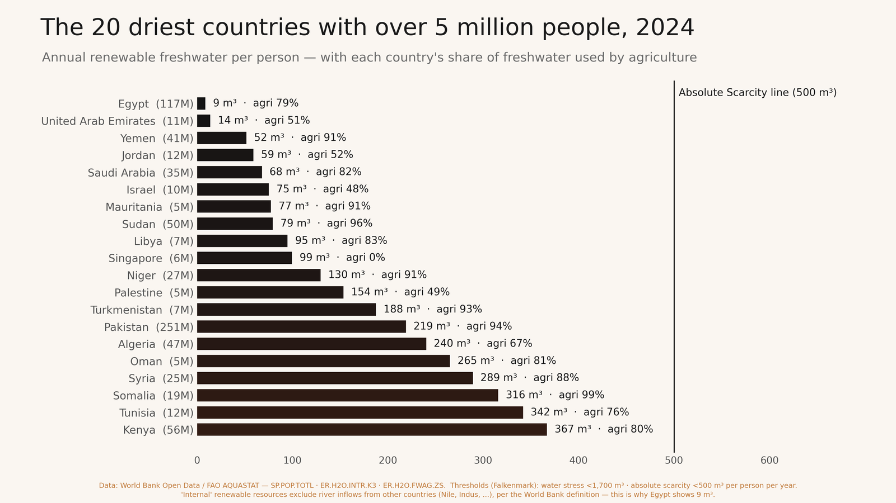

# 💧 Same Budget, More Water

[Live demo ↗](https://sanjaync.github.io/WaPOR_2026_team_39/) — Open the web tool (for people who miss the site).

> **Ranking Egypt's irrigation budget by the water that evaporated without growing a crop.**

🏆 *WaPOR Hackathon 2026 · Team 39*

---

## 🎬 Watch the Pitch

<iframe width="560" height="315" src="https://www.youtube.com/embed/9UaVdZKcHiA" frameborder="0" allow="accelerometer; autoplay; clipboard-write; encrypted-media; gyroscope; picture-in-picture; web-share" allowfullscreen></iframe>

---

## 🌾 The Vision


**Transforming water management from politics to hydrology.**

---

## 🎯 What This Is

Egypt's Ministry of Water Resources and Irrigation manages a constrained annual budget for modernising farms. The existing IPAT irrigation assessment tool identifies **where** water productivity i[...]

### 💡 The Breakthrough

**WaPOR satellites report two separate layers:**
- 🌱 **Transpiration (T)** — water that grew a crop  
- 💨 **Evaporation (E)** — water lost without yield

By ranking every governorate by recoverable evaporation and intervention cost, we transform a static map into an **ordered spending list**.

### 📊 The Impact

At a **$12M budget**, this prioritisation recovers **25% more water** than proportional distribution across irrigated area.

### 🔬 The Foundation

Built on **FAO WaPOR v3 Level 2** | 100 m resolution | 18 dekads (May–October 2024)

---

## 🌍 Why Egypt Matters

| Metric | Reality |
|--------|---------|
| 🚰 Freshwater per capita | Less than any country with 5+ million people |
| 🌾 Agricultural demand | 79% of total water |
| ⏰ Urgency | Climate change + population growth = existential challenge |



---

## 🚀 Quick Start

| 🎯 I want to... | 📂 Open |
|---|---|
| **🔧 Try the tool** | [`SUBMIT/03_tool/OPEN_ME_app.html`](SUBMIT/03_tool/OPEN_ME_app.html) — Download & double-click (no install) |
| **📄 Two-page brief** | [`SUBMIT/03_tool/Sample_2page_brief.pdf`](SUBMIT/03_tool/Sample_2page_brief.pdf) |
| **🎤 See the pitch** | [`SUBMIT/04_documents/Pitch_Deck.pptx`](SUBMIT/04_documents/Pitch_Deck.pptx) (editable) · [`PDF`](SUBMIT/04_documents/Pitch_Deck.pdf) |
| **📚 Deep dive** | [`SUBMIT/04_documents/Technical_Documentation.pdf`](SUBMIT/04_documents/Technical_Documentation.pdf) — Full methods + citations |
| **🎬 Watch the video** | [`SUBMIT/01_pitch_video/`](SUBMIT/01_pitch_video/) — 60-second narrated pitch |
| **💻 Run the code** | [`SUBMIT/05_code/`](SUBMIT/05_code/) — Complete pipeline (Python + Earth Engine) |
| **📓 Interactive notebook** | [Google Notebook](https://notebook.google.com/notebook/2f0f3797-bd0b-40da-96e6-f4b6b7ae8c5f) — Live analysis |

**⬇️ Get everything at once:** Green **Code** button → **Download ZIP**

---

## 🎮 Interactive Decision Page

The web-based tool features a **dynamic decision page** where all values update in real-time:

### 🎯 What You Can Do

1. **Adjust Budget & Parameters**
   - Change the annual budget allocation
   - Edit intervention costs (USD/ha)
   - Modify reduction fractions (% evaporation saved)
   - Adjust equipment lifespan
   - Set equity floor constraints

2. **Watch Slides Update Instantly**
   - Rankings recalculate as you change inputs
   - Allocation breakdown updates in real-time
   - Top-ranked governorates highlight dynamically
   - Cost-effectiveness metrics refresh

3. **Generate PDF Report Card**
   - **2-page downloadable brief** tailored to your parameters
   - Executive summary with decision metrics
   - Visual ranking table and allocation breakdown
   - Water recovery impact vs. baseline scenario
   - All assumptions clearly listed

### 📊 What the Report Includes

**Page 1 — Decision Summary:**
- Budget allocation ($M)
- Total water recovered (mm equivalent)
- % improvement vs. area-proportional split
- Top 5 governorates by cost-effectiveness
- Recommended priority order

**Page 2 — Technical Breakdown:**
- Full ranking table (all 20 governorates)
- Intervention costs & reduction assumptions used
- Equity floor impact analysis
- Methodology & data source notes

### 🔄 Real-Time Decision Making

**The key feature:** As stakeholders review the analysis, they can:
- Modify budget constraints on-the-fly
- Test "what-if" scenarios
- Generate updated reports instantly
- Export their custom scenario as a PDF

**All parameters in the web tool are fully editable because:**
- Intervention costs are literature estimates, not field measurements
- This is honest: uncertainties are transparent
- Decision-makers can validate against their own cost databases
- Rankings remain robust across reasonable cost ranges

---

## 📚 Complete Documentation

### 🎯 For Decision Makers

- **🎤 [`Pitch_Deck.pptx`](SUBMIT/04_documents/Pitch_Deck.pptx)** — Stakeholder presentation (10 slides, editable PowerPoint)
- **🎤 [`Pitch_Deck.pdf`](SUBMIT/04_documents/Pitch_Deck.pdf)** — Stakeholder presentation (10 slides, PDF format)
- **📄 [`Sample_2page_brief.pdf`](SUBMIT/03_tool/Sample_2page_brief.pdf)** — Executive summary in 2 pages
- **🔄 [`Decision Page`](#interactive-decision-page)** — Dynamic tool with live PDF generation

### 🔬 For Technicians & Researchers

- **📖 [`Technical_Documentation.pdf`](SUBMIT/04_documents/Technical_Documentation.pdf)** — Full methodology, data sources, assumptions, limitations, and citations
- **💻 [`Complete codebase`](SUBMIT/05_code/`](SUBMIT/05_code/) — Python pipeline + Google Earth Engine scripts + documentation

### 📖 For Storytelling & Context

- **🌍 [`The Big Picture`](THE_BIG_PICTURE.md)** — Egypt's water crisis and how this solution helps
- **🧮 [`The Methodology`](METHODOLOGY.md)** — How WaPOR satellites, math, and the greedy algorithm work together
- **🎯 [`From Tools to Decisions`](FROM_TOOLS_TO_DECISIONS.md)** — Why this decision-based approach transforms water budgeting

### 📂 All Materials

Find everything in **[`SUBMIT/04_documents/`](SUBMIT/04_documents/)**:
- Pitch decks (PPTX + PDF)
- Technical documentation
- Workbooks & reference materials
- Sample briefs + generated PDF reports

---

## 🔍 Key Findings

### 🎖️ Discovery 1: The Rice Belt Is More Efficient Than Expected

We anticipated the northern Delta rice paddies to waste the most water. **They waste the least.**

- **Damietta:** 0.157 evaporated fraction (most efficient)
- **Kafr El Sheikh:** 0.191 evaporated fraction

**Why?** The closed rice canopy shades the ponded water, suppressing surface evaporation even during flooding.

### ⚠️ Discovery 2: We Caught Our Own Data Contamination

Aswan initially ranked **#1 nationally** in recoverable evaporation.

**The problem:** Seasonal evaporation reached 1,834 mm—clearly from:
- Lake Nasser
- Toshka lakes
- Canals & fish ponds
- Other open water surfaces

**Our fix:** Applied a physical ceiling on cropland evaporation (agricultural limit). This removed contamination, reducing the national figure from **32% to 25%** water recovery potential.

**Lesson learned:** Always validate rankings against physical reality. The documentation discloses all corrections and limitations.

📖 **Full details:** [`SUBMIT/04_documents/Technical_Documentation.pdf`](SUBMIT/04_documents/Technical_Documentation.pdf)

---

## 📂 Repository Structure

```
📦 WaPOR_2026_team_39
├── 📹 SUBMIT/01_pitch_video/
│   ├── Silent visual track (60 seconds)
│   ├── Narration script
│   ├── Teleprompter notes
│   └── Shot list
│
├── 🎨 SUBMIT/02_miro/
│   └── Miro board content & visual narrative
│
├── 🔧 SUBMIT/03_tool/
│   ├── OPEN_ME_app.html (⭐ Interactive tool with decision page)
│   ├── Sample_2page_brief.pdf (example generated report)
│   └── README_TOOL.md (tool usage guide)
│
├── 📚 SUBMIT/04_documents/
│   ├── Pitch_Deck.pptx (editable)
│   ├── Pitch_Deck.pdf (view-only)
│   ├── Technical_Documentation.pdf
│   └── Workbook & references
│
└── 💻 SUBMIT/05_code/
    ├── pipeline/
    │   ├── config.py (tunable parameters)
    │   ├── 01_build_boundaries.py
    │   ├── 02_fetch_wapor.py (WaPOR download)
    │   ├── 03_zonal_stats.py (rasters → stats)
    │   ├── 04_rank_and_allocate.py (🎯 THE DECISION ENGINE)
    │   ├── 05_build_webmap.py (HTML generation with PDF support)
    │   │   └── gee/wapor_export.js (Earth Engine alternative)
    │
    ├── webmap/
    │   ├── template.html (full app: CSS + JS inline, offline-ready)
    │   ├── index.html (built output ⭐)
    │   └── pdf_generation.js (dynamic PDF report builder)
    │
    └── docs/
        ├── DATA_SOURCES.md
        └── ASSUMPTIONS.md
```

---

## ⚙️ How the Decision Algorithm Works

### 🧮 The Formula

```
📏 Recoverable water (m³)
   V = E_mm × irrigated_ha × 10 × reduction_fraction

💰 Annualised cost (USD/year)
   C = (USD/ha ÷ life_years) × irrigated_ha

📊 Cost per unit water
   c = C / V     [USD/m³]
```

**Then:** Sort all (district, intervention) pairs by cost **ascending** → Allocate budget down the list.

**Baseline:** The same budget distributed in proportion to irrigated area (current practice, gives +0% improvement).

### 🌾 Interventions Modelled

| 🛠️ Measure | 💵 Cost/ha | ⏱️ Life | 💨 E Reduction | ✅ Best for |
|-----------|--------:|-------:|------------:|-----------|
| **Laser land levelling** | $75 | 5 yr | 10% | **All crops** ⭐ (always selected) |
| Alternate wetting & drying | $25 | 1 yr | 10% | Rice belt only |
| Straw / plastic mulching | $260 | 1 yr | 30% | Non-rice (never selected) |
| Drip retrofit | $1,800 | 10 yr | 45% | Non-rice (never selected) |

🎮 **All parameters are editable live in the web map** — Change a number, watch rankings recalculate instantly. This is honest: these are literature-order estimates, not measurements. Better [...]

### 🗺️ Cropland Identification

**In Egypt:** Outside the irrigated Nile corridor, there is negligible rainfall and water. 

**Our method:** Use seasonal AETI (actual evapotranspiration) from WaPOR to separate:
- ✅ Irrigated cropland
- ❌ Desert

**Advantage:** No external land-cover product needed. No licensing constraints. Uses data we're already analyzing.

---

## 🎯 What We Achieve

### 📈 The Headline

At a **$12M budget**, targeting recovers **~25% more water** than area-proportional distribution.

### 🔬 What Actually Matters

#### Finding 1: The advantage is purely spatial
With evaporation held spatially flat (uniform across all districts), targeting gains **zero improvement**. All 25 percentage points come from satellite detail.

- ~8 points require genuine WaPOR-level detail
- ~17 points could be recovered with a coarse agronomic classification alone

**Implication:** WaPOR detail is necessary but not sufficient. Agronomic expertise matters.

#### Finding 2: Equity has a price
Reserving 25% of budget as an equity floor (minimum funding to all 20 governorates):
- Costs only **3.9% of the water savings**
- Funds all twenty governorates
- Pure cheapest-first approach funds only four

**Implication:** No ministry with an equity mandate signs pure optimization. Pricing the political constraint is more useful than ignoring it.

---

## ⚠️ Scope, Limitations & Honesty

### ✅ What This Claims

| Aspect | What We Say |
|--------|------------|
| **Recoverable evaporation** | Upper-bound estimate of water saveable through intervention |
| **Cost-effectiveness ranking** | Prioritisation order based on literature cost & performance |
| **Spatial advantage** | ~23 of 25 percentage points require satellite detail |
| **Editable assumptions** | All cost & reduction parameters are tunable in the tool |
| **Dynamic reporting** | PDF reports generated on-demand with current parameters |

### ❌ What This Does NOT Claim

| Limitation | Why |
|------------|-----|
| **Closed-basin water savings** | Field evaporation suppression ≠ basin water conservation. Some returns to drains/aquifers for reuse downstream. |
| **Precise water quantities** | Intervention costs & reduction fractions are literature estimates, not site measurements. Rankings are robust; absolute values are not. |
| **Observed MWRI practice** | This assumes even distribution. Actual budget allocation patterns are unstudied. |
| **Settled allocation** | This is a prioritisation hypothesis for **field validation**, not a final answer. |

### 🔍 Data Quality Notes

1. ✅ **Intervention costs** — Sourced from literature, editable in tool
2. ✅ **Evaporation data** — FAO WaPOR v3, validated against physical ceilings
3. ⚠️ **Cultivated areas** — Approximate planning figures, not CAPMAS/MALR statistics (replace before publishing)
4. ⚠️ **E/T split** — Least constrained over standing water; this is where our signal is strongest

**Philosophy:** Better to disclose limitations upfront than surprise stakeholders later.

📖 **Full documentation:** [`SUBMIT/04_documents/Technical_Documentation.pdf`](SUBMIT/04_documents/Technical_Documentation.pdf)

---

## 📊 Demo Results

### 🏆 Default Scenario: $12M Budget

- **Water recovered:** ~25% more than proportional distribution
- **Top-ranked governorate:** Kafr El Sheikh (most efficient evaporation recovery)
- **Primary intervention:** Laser land levelling (most cost-effective across all crops)
- **Equity floor (25% reserved):** Funds all 20 governorates at minimal cost to water savings

### 🎮 Try Your Own Budget

Run with custom budget:
```bash
./run_all.sh 25000000    # for $25M budget
```

The tool recalculates everything automatically, and can generate custom PDF reports.

---

## 🔗 Data & Attribution

### 📡 Primary Source
- **FAO WaPOR v3 Level 2** (100 m resolution, 18 dekads, May–October 2024)
  - Status: Open access
  - License: FAO open data

### 🗺️ Ancillary Data
- **Administrative boundaries:** FAO GAUL 2015
- **Surface water masking:** JRC Global Surface Water
- **Water scarcity data:** World Bank Open Data + FAO AQUASTAT

### 📚 References & Citations
All sources fully cited in:
- [`SUBMIT/04_documents/Technical_DocumentATION.pdf`](SUBMIT/04_documents/Technical_DocumentATION.pdf)
- `SUBMIT/05_code/docs/tex/refs.bib`

---

## 🚀 Getting Started with the Code

### 📋 Quick Demo (Synthetic Data)

```bash
cd SUBMIT/05_code
pip install -r requirements.txt
./run_all.sh
open webmap/index.html
```

**⚠️ Note:** Without WaPOR rasters, runs on **synthetic demo data** (clearly flagged with red banner on every screen).

### 🌐 With Real WaPOR Data

```bash
# On a machine with access to data.apps.fao.org
pip install wapordl                    # Requires GDAL
python3 pipeline/02_fetch_wapor.py     # Download L2 100m AETI, E, T, I
python3 pipeline/03_zonal_stats.py     # Compute per-district statistics
python3 pipeline/04_rank_and_allocate.py
python3 pipeline/05_build_webmap.py
open webmap/index.html
```

The red demo banner disappears automatically when real WaPOR data loads.

---

## 🎓 Learn More

### 📺 Video Content
- **🎬 [`60-second pitch`](SUBMIT/01_pitch_video/)** (silent visual + narration script)
- **📓 [`Google Notebook`](https://notebook.google.com/notebook/2f0f3797-bd0b-40da-96e6-f4b6b7ae8c5f)** (interactive analysis walkthrough)

### 📖 Written Deep Dives
- **🌍 [`Technical_Documentation.pdf`](SUBMIT/04_documents/Technical_DocumentATION.pdf)** — Full methodology & limitations
- **🌍 [`THE_BIG_PICTURE.md`](THE_BIG_PICTURE.md)** — Water crisis context
- **🧮 [`METHODOLOGY.md`](METHODOLOGY.md)** — Algorithm & math
- **🎯 [`FROM_TOOLS_TO_DECISIONS.md`](FROM_TOOLS_TO_DECISIONS.md)** — Decision framework

---

## 🎖️ Project Status

✅ **Hackathon Phase:** Complete
- Tool built & tested with dynamic decision page
- PDF report generation integrated
- Analysis complete
- Documentation finalized
- Code open-sourced

🔄 **Next Steps:**
- Field validation with MWRI
- Refinement with real on-farm data
- Integration with IPAT platform
- Pilot implementation

---

## 📞 Questions?

**Repository:** [github.com/sanjaync/WaPOR_2026_team_39](https://github.com/sanjaync/WaPOR_2026_team_39)

**Event:** WaPOR Hackathon 2026

**Category:** Water Productivity | Irrigation Modernization | Decision Support

---

<div align="center">

### 💧 *Turning satellite data into water policy that works.*

**Same budget. More water. Better decisions.**

</div>
