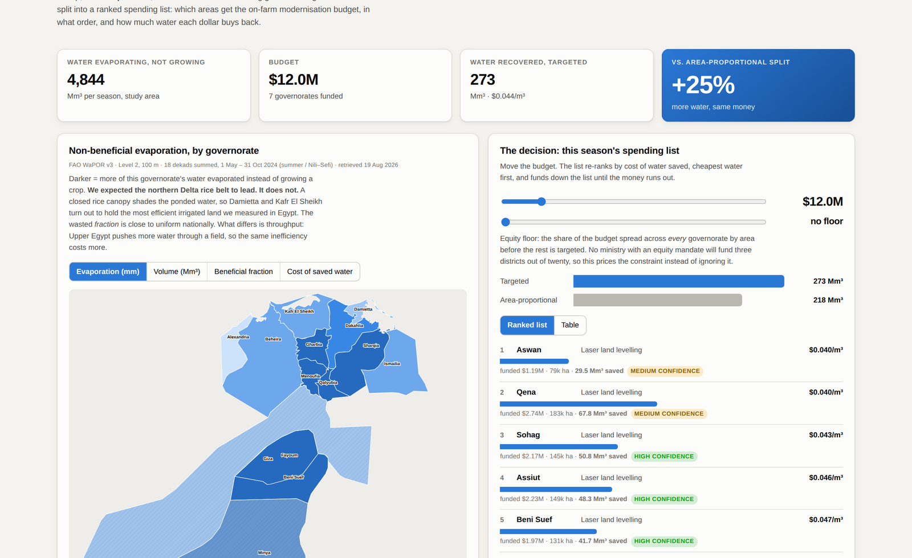

# Same Budget, More Water

**Ranking Egypt's on-farm modernisation budget by the water that evaporated
without growing a crop.**

WaPOR Hackathon 2026 · Team 39 · Sanjay N C



---

## What this is

Egypt's Ministry of Water Resources and Irrigation spends an annual budget
modernising farms and has to justify it. IPAT, the irrigation assessment tool
already running on the ministry platform, shows where water productivity is low.
It does not say where to spend.

WaPOR reports evaporation and transpiration as separate layers. Transpiration is
water that grew a crop; evaporation is water that left the field having grown
nothing. This work ranks every governorate by how much of that evaporated water
is recoverable and what it costs to recover, and turns the result into an ordered
spending list.

At a $12M budget, spending down that order recovers **25% more water** than
distributing the same budget in proportion to irrigated area.

Built on FAO WaPOR v3 Level 2, 100 m, 18 dekads covering 1 May to 31 October 2024.

### Why Egypt

No country with more than five million people has less freshwater of its own, and
agriculture takes 79% of what there is.


---

## Start here

| I want to… | Open |
|---|---|
| **See the tool** | [`SUBMIT/03_tool/OPEN_ME_app.html`](SUBMIT/03_tool/OPEN_ME_app.html) — download and double click, no install |
| **Read the idea in two pages** | [`SUBMIT/03_tool/Sample_2page_brief.pdf`](SUBMIT/03_tool/Sample_2page_brief.pdf) |
| **See the pitch** | [`SUBMIT/04_documents/Pitch_Deck.pdf`](SUBMIT/04_documents/Pitch_Deck.pdf) |
| **Read the method and citations** | [`SUBMIT/04_documents/Technical_Documentation.pdf`](SUBMIT/04_documents/Technical_Documentation.pdf) |
| **Watch the pitch video** | [`SUBMIT/01_pitch_video/`](SUBMIT/01_pitch_video/) |
| **Run the analysis yourself** | [`SUBMIT/05_code/`](SUBMIT/05_code/) |
| **Open the notebook** | [Notebook](https://notebook.google.com/notebook/2f0f3797-bd0b-40da-96e6-f4b6b7ae8c5f) |

To get everything at once: green **Code** button above → **Download ZIP**.

---

## Folder guide

```
SUBMIT/
  01_pitch_video/   the 60 second pitch: silent visual track, the script that
                    adds the narration, teleprompter, shot list
  02_miro/          text ready to drop onto the team Miro board
  03_tool/          the working tool, a single HTML file that works offline
  04_documents/     deck, concept note, technical documentation, workbook
  05_code/          the full pipeline, Python and Earth Engine
```

---

## Two findings worth knowing before you read anything else

**We were wrong about the rice belt.** We expected the northern Delta paddies to
waste the most water. They waste the least: Damietta 0.157 and Kafr El Sheikh
0.191 evaporated share, the most efficient irrigated land we measured in Egypt. A
closed rice canopy shades the ponded water, so ponding does not imply
evaporation.

**We contaminated our own result and caught it.** Aswan ranked first nationally
until we checked the pixels behind it and found seasonal evaporation reaching
1,834 mm. Lake Nasser, the Toshka lakes, canals and fish ponds had survived both
the satellite water mask and our beneficial-fraction test. A physical ceiling on
cropland evaporation removed them, and most of Aswan's lead went with it. The
national figure fell from 32% to 25%.

Both corrections, and the full list of limitations, are in
[`SUBMIT/04_documents/Technical_Documentation.pdf`](SUBMIT/04_documents/Technical_Documentation.pdf).

---

## What this does not claim

Evaporation saved on a field is not automatically water saved in a closed basin;
some of it was already returning to drains and being reused downstream.
Recoverable evaporation is an upper bound. Intervention costs are literature
estimates rather than measurements, so the ranking of places is robust while the
size of the prize is not. Chukalla et al. (2022) excluded the beneficial fraction
from their WaPOR irrigation performance framework on accuracy grounds; the
documentation sets out why we think a relative ordering remains defensible, and
why the right status for this output is a prioritisation hypothesis for field
validation rather than a settled allocation.

---

## Data and licence

WaPOR v3 is published by FAO under open access. Administrative boundaries are FAO
GAUL 2015. Surface water masking uses JRC Global Surface Water. Water scarcity
figures are World Bank Open Data and FAO AQUASTAT. Full citations are in
[`SUBMIT/04_documents/Technical_Documentation.pdf`](SUBMIT/04_documents/Technical_Documentation.pdf)
and `SUBMIT/05_code/docs/tex/refs.bib`.
